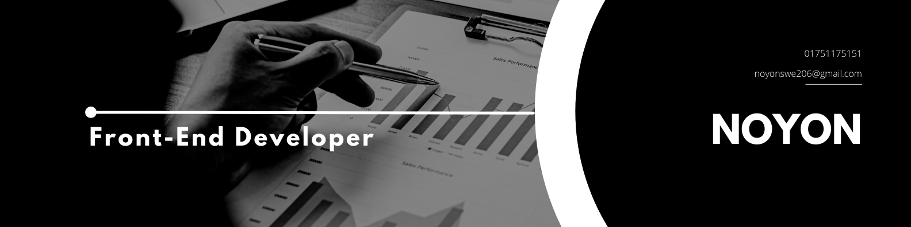

<h1 align="center">Hi , I'm Ashadujjaman Noyon</h1>
<h3 align="center">A passionate frontend developer from Bangladesh</h3>

 

## Fast learner & go-getter. JavaScript & Design Pattern Enthusiast. 🙌

- 🌱 I’m currently learning **TypeScript**

- 👨‍💻 All of my projects are available at [https://ashadujjaman-noyon.vercel.app/](https://ashadujjaman-noyon.vercel.app/)

- 💬 Ask me about **React,JavaScript**

- 📫 How to reach me **noyonswe206@gmail.com**
  
- 🥅 2024 Goals: MERN stack developer

- ⚡ Fun fact: **I think someday JavaScript will save the world!**

<h3 align="left">Connect with me:</h3>

## Languages and Tools 🚀

### Programming Language 👉

 

### Front-end 👉

      

 

 

 
